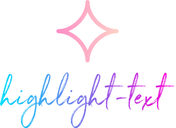

<p align="center">

</p>
<p align="center"> English | <a href="./README_zh.md">简体中文</a></p>

Customize the highlight syntax of any language, such as vue, react, svelte, solid, etc. You can emphasize some specific syntax or events, make it easier for you to read the code and make your editor look more unique. If you think your matching style is cool, welcome to mention pr, which can be used as a built-in template style for more people.


## Configuration
```typescript
  // You can configure the style you want through setting.
        "vscode-highlight-text.rules": {
          "type": "object",
          "default": {
            "vue": {
              "light": {
                "purple": {
                  "match": [
                    "v-if",
                    "v-else-if",
                    "v-else"
                  ],
                  "before": {
                    "contentText": "✨"
                  }
                },
                "#B392F0": [
                  "v-for"
                ],
                "#FFC83D": [
                  "<template\\s+(\\#[^\\s\\/>=]+)",
                  "v-bind",
                  "v-once",
                  "v-on",
                  "(v-slot:[^>\\s\\/>]+)",
                  "v-html",
                  "v-text"
                ],
                "rgb(99, 102, 241)": [
                  ":is"
                ],
                "rgb(14, 165, 233)": [
                  "(defineProps)[<\\(]",
                  "defineOptions",
                  "defineEmits",
                  "defineExpose"
                ]
              },
              "dark": {
                "purple": {
                  "match": [
                    "v-if",
                    "v-else-if",
                    "v-else"
                  ],
                  "before": {
                    "contentText": "✨"
                  }
                },
                "#B392F0": [
                  "v-for"
                ],
                "#FFC83D": [
                  "<template\\s+(\\#[^\\s\\/>=]+)",
                  "v-bind",
                  "v-once",
                  "v-on",
                  "(v-slot:[^>\\s\\/>]+)",
                  "v-html",
                  "v-text"
                ],
                "rgb(99, 102, 241)": {
                  "match": [
                    ":is"
                  ]
                },
                "rgb(14, 165, 233)": [
                  "(defineProps)[<\\(]",
                  "defineOptions",
                  "defineEmits",
                  "defineExpose"
                ]
              }
            },
            "react": {
              "light": {},
              "dark": {}
            }
          },
          "description": "highlight vue | react | svelte | solid | astro | ... style"
        }
```

## Feature
- You can apply the same configuration to multiple type files separated by `|`. The following example is a common configuration for `react, typescript, and javascript`

```json
{
  "react|typescript|javascript": {
    "light": {},
    "dark": {}
  }
}
```

## Show your style

- You can share the style you think is cool [here](https://github.com/Simon-He95/vscode-highlight-text/issues/5), or you can submit PR as a built-in template style selection Make it available to more people.

## :coffee:

[buy me a cup of coffee](https://github.com/Simon-He95/sponsor)

## License

[MIT](./license)

## Sponsors

<p align="center">
  <a href="https://cdn.jsdelivr.net/gh/Simon-He95/sponsor/sponsors.svg">
    
  </a>
</p>
